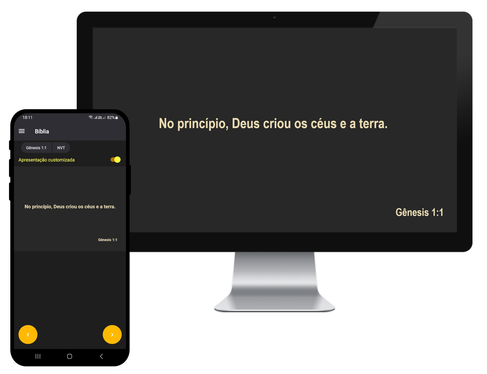

<p align="center">
  <a href="https://github.com/ludum-pro-bono/ludum-pro-bono-games">
    
  </a>

  <h1 align="center">Soundbot</h1>

  <p align="center">
    Software de código aberto capaz de exibir textos e vídeos na tela de um computador remotamente.
    <br />
    <br />
    <a href="https://github.com/luanws/soundbot/releases/latest">Download</a>
    🔹
    <a href="https://github.com/luanws/soundbot/issues">Reportar Bug</a>
    🔹
    <a href="https://github.com/luanws/soundbot/issues">Sugerir funcionalidade</a>
  </p>
</p>



## 📖 Sobre o projeto

O _Soundbot_ é composto por um software desktop que pode ser controlado remotamente por um aplicativo mobile através de uma conexão Wi-Fi.

Atualmente, o _Soundbot_ é capaz realizar as seguintes ações:

* Exibir textos bíblicos;
* Projetar hinos do HASD (Hinário Adventista do Sétimo Dia);
* Reproduzir músicas no formato de vídeo;
* Reproduzir os vídeos do Provai e Vede.

## 📥 Download

### 💻 Download do software desktop

Pra instalar o Soundbot no Windows, siga as etapas:

1. Acesse o último [lançamento](https://github.com/luanws/soundbot/releases/latest) do projeto;
2. Baixe o arquivo `Soundbot Setup.exe`;
3. Faça a instalação do software executando o arquivo `Soundbot Setup.exe`;
4. Execute o programa abrindo o arquivo `Soundbot.exe`;
5. Se não houver imagem ao tentar reproduzir um vídeo, instale o [k-lite codec pack](https://drive.google.com/file/d/1b4MPId_NZPkwFL5Qnt5PyDy9iXKoQ9qs/view?usp=sharing) e tente novamente.

O software reproduz somente os vídeos que já se encontram no computador. Caso você queira reproduzir os hinos do HASD, [clique aqui](https://drive.google.com/drive/folders/1XVaDUblS-r2XMgi-eb-MCYhw2xhq-tiV?usp=sharing) para baixar os hinos.

Após isso, você deve acessar as configurações do software para informar a localização dos vídeos e hinos.

### 📱 Download do aplicativo mobile

Se você estiver usando um dispositivo Android, baixe o arquivo `Soundbot.apk` no [GitHub Releases](https://github.com/luanws/soundbot/releases/latest) e instale-o.

## 🧑‍💻 Executando o software desktop para fins de desenvolvimento

Para seguir as etapas abaixo, navegue até a pasta `desktop` do projeto.

### 📋 Pré-requisitos

Antes de começar, verifique se você atendeu aos seguintes requisitos:

* Você tem uma máquina `<Windows / Linux / Mac>`;
* Você instalou o [Python 3.7](https://www.python.org/).

### 📦 Instalação

Para instalar as dependências do software desktop, execute o seguinte comando:

```
pip install -r requirements.txt
```

### 📚 Utilização

Execute o seguinte comando:

```
python main.dev.py
```

## 📱 Executando o aplicativo mobile para fins de desenvolvimento

Para seguir as etapas abaixo, navegue até a pasta `app` do projeto.

### 📋 Pré-requisitos

Antes de começar, verifique se você atendeu aos seguintes requisitos:

* Você tem uma máquina `<Windows / Linux / Mac>`;
* Você tem um dispositivo `<Android / iOS>`;
* Você instalou o [Node.js](https://nodejs.org/en/).

### 📦 Instalação

Para instalar as dependências do aplicativo mobile, execute o seguinte comando:

```
npm install
```

### 📚 Utilização

Execute o seguinte comando:

```
npm run dev
```

## 📫 Contribuindo

Pull requests são sempre bem-vindos 😄.

Consulte a documentação do GitHub em [como criar uma solicitação pull](https://help.github.com/en/github/collaborating-with-issues-and-pull-requests/creating-a-pull-request).

## 📝 Licença

Esse projeto está sob licença. Veja o arquivo [LICENÇA](LICENSE) para mais detalhes.